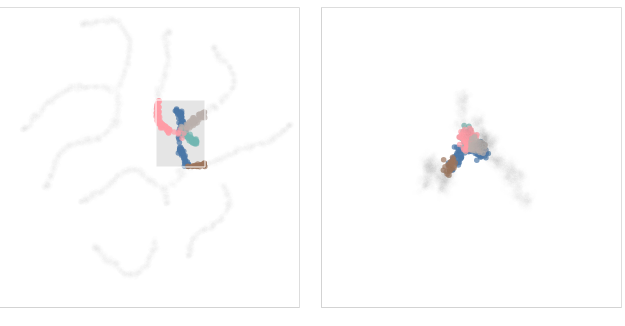

```{r setup, include=FALSE}
knitr::opts_chunk$set(echo = TRUE)
```

## Introduction

This R Markdown file demonstrates the **Easy Test** solution for interactive visualization using the **Liminal** package. We will use a t-SNE embedding and a linked grand tour to explore the **fake_trees** dataset.

## Step 1: Load Packages

Install and load the necessary packages.

```{r packages}
# Install packages if not already installed
if (!require("liminal")) install.packages("liminal")
if (!require("Rtsne")) install.packages("Rtsne")
if (!require("ggplot2")) install.packages("ggplot2")
if (!require("dplyr")) install.packages("dplyr")

# Load libraries
library(liminal)
library(Rtsne)
library(ggplot2)
library(dplyr)
```

## Step 2: Load and Prepare Data

We use the **fake_trees** dataset available in the Liminal package.

```{r data-preparation}
data("fake_trees")
head(fake_trees)
```

## Step 3: Compute PCA

To obtain columns PC1 to PC10, we perform Principal Component Analysis (PCA) on the dataset.

```{r pca-computation}
pcs <- prcomp(select(fake_trees, starts_with("dim")), scale. = TRUE)
pcs_df <- as.data.frame(pcs$x)
colnames(pcs_df) <- paste0("PC", 1:ncol(pcs_df))

# Merge PCA results with original dataset
fake_trees <- cbind(fake_trees, pcs_df)
head(fake_trees)
```

## Step 4: Compute t-SNE

Using t-SNE to reduce the dimensions of the dataset:

```{r tsne-computation}
set.seed(2099)
tsne <- Rtsne(select(fake_trees, starts_with("dim")))
tsne_df <- data.frame(tsneX = tsne$Y[,1], tsneY = tsne$Y[,2])
```

## Step 4: Plot t-SNE Results

We plot the t-SNE results and color by the **branches** variable.

```{r tsne-plot}
ggplot(tsne_df, aes(x = tsneX, y = tsneY, color = fake_trees$branches)) +
  geom_point() +
  scale_color_manual(values = limn_pal_tableau10()) +
  ggtitle("t-SNE Plot Colored by Branches")
```

## Step 6: Linked t-SNE and Grand Tour

Below is a snapshot of the linked brushing interface:



### Understanding Linked Brushing

Linked brushing refers to the ability to select points in one plot (like the t-SNE view) and see the corresponding points highlighted in the other (grand tour) view. In the image above: - The **left panel** shows the interactive t-SNE plot. - The **right panel** displays the dynamic grand tour view. - By selecting a region on the left, the corresponding points in the right view are highlighted, allowing us to understand how the NLDR method (t-SNE) relates to the original high-dimensional structure.

This interactivity is crucial for diagnosing possible distortions introduced by NLDR methods, helping analysts validate and interpret cluster structures accurately. Using `limn_tour_link` to create a linked tour:

```{r linked-tour, eval=FALSE}
limn_tour_link(embed_data = tsne_df,
               tour_data = fake_trees,
               cols = PC1:PC10,
               color = branches)
```

## Step 7: Storing the Result

Optionally, we can store the result of the linked tour:

```{r store-result, eval=FALSE}
res <- limn_tour_link(embed_data = tsne_df,
                      tour_data = fake_trees,
                      cols = PC1:PC10,
                      color = branches)
```

## Conclusion

This solution demonstrates how to use the Liminal package to explore high-dimensional data interactively, comparing t-SNE embeddings with a linked grand tour. Linked brushing helps us understand discrepancies and potential artifacts in the t-SNE visualization.
